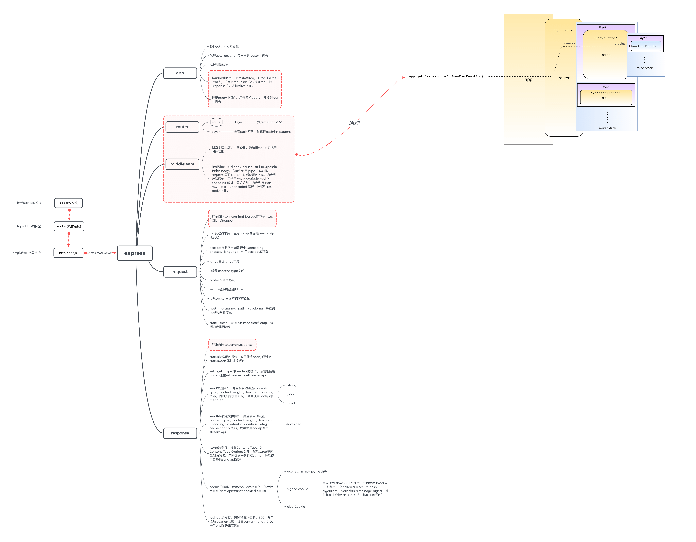

# express

## 实现

实现一个小型的express，支持以下功能：

1. 基本的服务器
2. 基本的路由，router 和 route
3. 基本的中间件
4. res 和 req 的基本功能
5. 设置 header，支持 etag
6. jsonp
7. 设置cookie、redirect
8. 发送和下载文件

没有这些功能：

1. 基本的错误处理。(所以需要严格按照基本语法来写，不然程序会崩溃)
2. 不支持 async await
3. 不支持 mount 子 express 实例
4. 不支持设置各种 request 头
5. 不支持模板引擎和相关的 header、link 等配置
6. 不支持 proxy

## express架构图



## 比较典型的package和实现

express 源码里面的一些 package 和实现

1.[etag 库](https://www.npmjs.com/package/etag)。里面判断是一个 fs.Stats 对象还是一个实体，如果是一个 fs.Stats 对象，则使用文件信息中的 size 和 mtime进行拼接；如果是一个实体，则使用 crypto 库取摘要等信息。（其中 toString(16) 好像很奇妙，但是目前我还不知道是什么意思）

```js
// 主要代码
var tag = isStats
  ? stattag(entity)
  : entitytag(entity)

function stattag (stat) {
  var mtime = stat.mtime.getTime().toString(16)
  var size = stat.size.toString(16)

  return '"' + size + '-' + mtime + '"'
}

function entitytag (entity) {
  if (entity.length === 0) {
    // fast-path empty
    return '"0-2jmj7l5rSw0yVb/vlWAYkK/YBwk"'
  }

  // compute hash of entity
  var hash = crypto
    .createHash('sha1')
    .update(entity, 'utf8')
    .digest('base64')
    .substring(0, 27)

  // compute length of entity
  var len = typeof entity === 'string'
    ? Buffer.byteLength(entity, 'utf8')
    : entity.length

  return '"' + len.toString(16) + '-' + hash + '"'
}
```

2.[safe-buffer](https://www.npmjs.com/package/safe-buffer)。这个库是用来在各个版本的 nodejs 里面兼容 buffer api的。它会判断 nodejs 里面的 buffer api 是否已经有相关方法，如果有则直接使用这个 buffer api；如果没有则使用这个库的 pollyfill。代码如下：

```js
if (Buffer.from && Buffer.alloc && Buffer.allocUnsafe && Buffer.allocUnsafeSlow) {
  module.exports = buffer
} else {
  // Copy properties from require('buffer')
  copyProps(buffer, exports)
  exports.Buffer = SafeBuffer
}
```

另外，这个库，在调用 send api 之后会处理各种 options，然后返回一个继承自 Stream 的 SendStream 对象实例，这个对象有一个 pipe 方法，调用这个 pipe 方法才会调用 createReadStream 方法然后真正发送数据。代码如下:

```js
function send (req, path, options) {
  return new SendStream(req, path, options)
}

SendStream.prototype.stream = function stream (path, options) {
  // TODO: this is all lame, refactor meeee
  var finished = false
  var self = this
  var res = this.res

  // pipe
  var stream = fs.createReadStream(path, options)
  this.emit('stream', stream)
  stream.pipe(res)

  // response finished, done with the fd
  onFinished(res, function onfinished () {
    finished = true
    destroy(stream)
  })

  // error handling code-smell
  stream.on('error', function onerror (err) {
    // request already finished
    if (finished) return

    // clean up stream
    finished = true
    destroy(stream)

    // error
    self.onStatError(err)
  })

  // end
  stream.on('end', function onend () {
    self.emit('end')
  })
}
```

3.[send](https://www.npmjs.com/package/send)包以流的形式发送文件，并能够自动加上各种http头。另外，它引入并暴露了一个mime库[mime](https://www.npmjs.com/package/mime)供我们使用。mime库先使用正则获取所传路径的文件后缀，然后通过查询mime-db来获取mime类型，代码如下，并且它支持自定义mime类型。

```js
path = String(path);
let last = path.replace(/^.*[/\\]/, '').toLowerCase();
let ext = last.replace(/^.*\./, '').toLowerCase();
```

4.[cookie-signature](https://www.npmjs.com/package/cookie-signature)库能够对 cookie 进行签名。它生成摘要的是常用的技术：首先使用 sha256 进行加密，然后使用 base64 生成摘要（sha的全称是secure hash algorithm，md的全程是message-digest，他们都是生成摘要的加密方法，都是不可逆的。hmac是一个建立在hash上面的加密认证技术，它需要一个秘钥）。代码如下：

```js
exports.sign = function(val, secret){
  if ('string' != typeof val) throw new TypeError("Cookie value must be provided as a string.");
  if ('string' != typeof secret) throw new TypeError("Secret string must be provided.");
  return val + '.' + crypto
    .createHmac('sha256', secret)
    .update(val)
    .digest('base64')
    .replace(/\=+$/, '');
};
```

5.[body-parser](https://www.npmjs.com/package/body-parser)库能够解析 request 的 body，然后挂载到 request.body 上面去。它支持 json、raw、text、urlencoded 等的解析。它首先使用 pipe 方法获取 request 里面的内容（由于 http.IncomingMessage 是 request 和 response 的父类，所以 request 和 response 都能使用 pipe方法），然后使用[zlib库](https://www.npmjs.com/package/zlib)对内容进行解压缩（gzip、deflate等压缩），再使用[raw-body库](https://www.npmjs.com/package/raw-body)对内容进行 encoding 解析（utf-8等形式），最后分别对内容进行 json、raw、text、urlencoded 解析并挂载到 res.body 上面去。

## 其它

1.扫描 tcp 端口，确认服务已经起来了，使用 nc 命令如下：

``` bash
nc -v -z localhost 2997-3000

输出：
nc: connectx to localhost port 2997 (tcp) failed: Connection refused
nc: connectx to localhost port 2997 (tcp) failed: Connection refused
nc: connectx to localhost port 2998 (tcp) failed: Connection refused
nc: connectx to localhost port 2998 (tcp) failed: Connection refused
nc: connectx to localhost port 2999 (tcp) failed: Connection refused
nc: connectx to localhost port 2999 (tcp) failed: Connection refused
Connection to localhost port 3000 [tcp/hbci] succeeded!
```

2.一般在判断是否为 undefined 的地方去判断是否等于 null 会更好(除非需要要 null 才不使用这种方法)，代码如下：

``` js
var path = getPathname(req);
if (path == null) {
  return done(layerError);
}
```

3.正则匹配路径是很耗性能的，为了提速，预先检测 star 和 slash，当匹配的时候，如果是 star 或者 slash 就不使用正则了。代码如下：

``` js
// set fast path flags
this.regexp.fast_star = path === '*'
this.regexp.fast_slash = path === '/' && opts.end === false

// 匹配代码
if (path != null) {
  // fast path non-ending match for / (any path matches)
  if (this.regexp.fast_slash) {
    this.params = {}
    this.path = ''
    return true
  }

  // fast path for * (everything matched in a param)
  if (this.regexp.fast_star) {
    this.params = {'0': decode_param(path)}
    this.path = path
    return true
  }

  // match the path
  match = this.regexp.exec(path)
}
```

4.express 里面是怎么处理 options 请求的。（待定）

5.处理 url 的时候，要注意转义：

```js
try {
  return decodeURIComponent(val);
} catch (err) {
  if (err instanceof URIError) {
    err.message = 'Failed to decode param \'' + val + '\'';
    err.status = err.statusCode = 400;
  }

  throw err;
}
```

6.增加局部变量来提升性能：

```js
var keys = this.keys;
var params = this.params;

for (var i = 1; i < match.length; i++) {
  var key = keys[i - 1];
  var prop = key.name;
  var val = decode_param(match[i])

  if (val !== undefined || !(hasOwnProperty.call(params, prop))) {
    params[prop] = val;
  }
}
```

7.有一个缺陷，就是使用hash的时候：

```js
this.cache = {};

// 应该用下面的形式
this.cache = Object.create(null)
this.cache = new Map()
```

8.express里面router有一层layer，route也有一层layer，其中router那层的layer是处理url匹配的，route那层的layer是处理method匹配，并处理callback数组的。

9.express 在初始化的时候会自己初始化两个中间件，一个中间件把 query 绑到 res 上面去，一个中间件把自己定义的 request 和 response 分别绑到 req 和 res 上面去：

```js
module.exports = function query(options) {
  var opts = merge({}, options)
  var queryparse = qs.parse;

  if (typeof options === 'function') {
    queryparse = options;
    opts = undefined;
  }

  if (opts !== undefined && opts.allowPrototypes === undefined) {
    // back-compat for qs module
    opts.allowPrototypes = true;
  }

  return function query(req, res, next){
    if (!req.query) {
      var val = parseUrl(req).query;
      req.query = queryparse(val, opts);
    }

    next();
  };
}

exports.init = function(app){
  return function expressInit(req, res, next){
    if (app.enabled('x-powered-by')) res.setHeader('X-Powered-By', 'Express');
    req.res = res;
    res.req = req;
    req.next = next;

    setPrototypeOf(req, app.request)
    setPrototypeOf(res, app.response)

    res.locals = res.locals || Object.create(null);

    next();
  };
}
```

10.便捷的把一个数组的所有元素都转换成字符串的方法：

```js
// not recommended
const value = val.map(item => String(item))

// recommended
const value = val.map(String)
```

11.在传输 json 的时候，使用了 v8 优化的 JSON.sringify：

```js
/**
 * Stringify JSON, like JSON.stringify, but v8 optimized, with the
 * ability to escape characters that can trigger HTML sniffing.
 *
 * @param {*} value
 * @param {function} replaces
 * @param {number} spaces
 * @param {boolean} escape
 * @returns {string}
 * @private
 */
function stringify (value, replacer, spaces, escape) {
  // v8 checks arguments.length for optimizing simple call
  // https://bugs.chromium.org/p/v8/issues/detail?id=4730
  var json = replacer || spaces
    ? JSON.stringify(value, replacer, spaces)
    : JSON.stringify(value);

  if (escape) {
    json = json.replace(/[<>&]/g, function (c) {
      switch (c.charCodeAt(0)) {
        case 0x3c:
          return '\\u003c'
        case 0x3e:
          return '\\u003e'
        case 0x26:
          return '\\u0026'
        /* istanbul ignore next: unreachable default */
        default:
          return c
      }
    })
  }

  return json
}
```

12.在传输 json 或者 html 等 string 的时候，给 content-type 自动加上了 utf-8:

```js
// write strings in utf-8
if (typeof chunk === 'string') {
  encoding = 'utf8';
  type = this.get('Content-Type');

  // reflect this in content-type
  if (typeof type === 'string') {
    this.set('Content-Type', setCharset(type, 'utf-8'));
  }
}
```

13.express 里面没有自动设置 Cache-Control 的方法，需要自己手动设置(但是express有自动设置etag)。在send.js库里面是使用 toUTCString 方法设置 last-modified 头部的，代码如下，其中 stat.mtime 是一个Date对象：

```js
if (this._lastModified && !res.getHeader('Last-Modified')) {
  var modified = stat.mtime.toUTCString()
  debug('modified %s', modified)
  res.setHeader('Last-Modified', modified)
}
```

14.有一种cookie叫做 signed cookie，它会在普通cookie后面加一个摘要信息防止被篡改。有一种 url 叫做 signed url，它在url的query上面加一些字段，提供用户对url的一些有限的访问控制，比如访问时间限制等。

15.服务器清除cookie的方法是：给这个cookie的value设置为空字符串，然后设置过期时间为new Date(1)。

16.redirect的机制是设置状态码为302，然后设置http头location为要跳转的url，最后发出响应给客户端

17.session cookie 在 session 结束的时候被删除，session 什么时候结束一般由浏览器决定，一般浏览器在被关闭的时候才会 session 结束；而 sessionStorage 则是在浏览页被关闭的时候就会被删除。